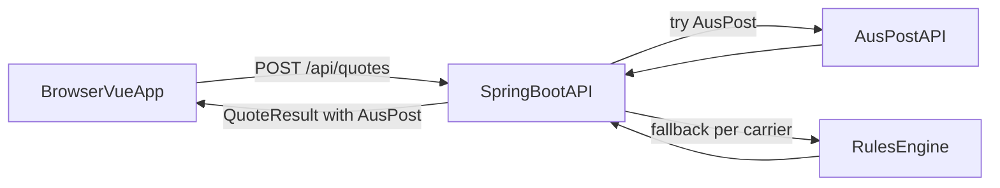

## Quotes Architecture

### Overview

This document describes how the application computes quotes from Australia Post and internal rules, and how results are exposed via the API and consumed in the Vue frontend.
<!-- Sendle integration is currently disabled. -->

### Data Model

Backend DTOs mirror the JSON schemas in `api-contract.md`:

- `OriginSettings`
- `Item`
- `Packaging`
- `ShipmentRequest`
- `CarrierQuote`
- `QuoteResult`
- `WeightBracket` (internal model for rule-based pricing)

`QuoteResult` combines:

- `carrierQuotes[]`: one entry per carrier (AusPost) when available. Each entry is a `CarrierQuote` with fields such as `carrier`, `serviceName`, `deliveryEtaDaysMin/Max`, `packagingCostAud`, `deliveryCostAud`, `totalCostAud`, `pricingSource`, and `ruleFallbackUsed`.

When an API is unavailable or fails for a carrier, the backend attempts to generate a quote for that **same carrier** from the rules engine, setting `pricingSource = "RULES"` and `ruleFallbackUsed = true`.

### Spring Boot Controllers & Services

- **Controllers** implement the REST endpoints:
  - `POST /api/quotes` → `QuoteResult` with AusPost options when available.

- **Provider SPI**:
  - Providers implement `CarrierProvider` with:
    - `quote(request, origin, packaging, items)` for a single best quote (optional).
    - `quotes(request, origin, packaging, items)` for multiple quotes (optional).
  - Providers may ignore `quotes` or return a list depending on provider capabilities.

- **Service Flow for `/api/quotes`** (simplified):

  1. Validate `ShipmentRequest` (origin must be configured, item/packaging IDs must exist, quantities > 0).
  2. Compute canonical total weight and approximate volume from items + packaging (packaging tracks length/height/width and internal volume).
  3. For AusPost:
     - Call AusPost API when configured; otherwise fall back to AusPost rules with `pricingSource = "RULES"` and `ruleFallbackUsed = true`.
  4. Return the AusPost result in a `QuoteResult`.

### Rule-Based Pricing

When carrier APIs are unavailable or fail, the backend uses rule-based pricing with `WeightBracket` definitions. Each `WeightBracket` specifies:

- **Weight range**: `minWeightInclusive` to `maxWeightInclusive` (in kilograms)
- **Standard price**: `priceStandard` (AUD) for regular/standard service
- **Express price**: `priceExpress` (AUD) for express/fast service

The rule engine:
1. Calculates total shipment weight in kilograms
2. Finds the matching `WeightBracket` where the weight falls within the range
3. Selects the appropriate price based on the `isExpress` flag from `ShipmentRequest`
4. Constructs a `CarrierQuote` with `pricingSource = "RULES"` and `ruleFallbackUsed = true`

**Weight Brackets:**
- Weight brackets are retrieved via `SettingsService.getAusPostWeightBrackets()`
- The brackets are defined in `SettingsServiceImpl` and returned as an unmodifiable list
- Example AusPost weight brackets:
  - 0 - 0.25 kg: Standard $9.70, Express $12.70
  - 0.25 - 0.5 kg: Standard $11.15, Express $14.65
  - 0.5 - 1.0 kg: Standard $15.25, Express $19.25
  - 1.0 - 3.0 kg: Standard $19.30, Express $23.80
  - 3.0 - 5.0 kg: Standard $23.30, Express $31.80

### Utility Classes

**PostcodeUtils:**
- `isMetro(int postcode)`: Determines if a given postcode (as integer) is within a metropolitan area
- Used for zone-based pricing calculations (metro vs. regional)
- Contains predefined ranges for major Australian metropolitan areas (Sydney, Melbourne, Brisbane, Adelaide, Perth, etc.)
- Returns `true` if the postcode falls within any of the defined metro ranges, `false` otherwise

**DeliveryEtaUtils:**
- `calculateEta(int/String originPostcode, int/String destinationPostcode, String originState, String destinationState, boolean isExpress)`: Calculates delivery ETA based on service type, state, and postcode types
- Returns `EtaResult` record with `minDays` and `maxDays`
- Logic:
  - Express: Same state 1-2 days, Interstate 1-3 days. Add 2 days to max if both rural, 1 day for metro to rural.
  - Standard: Same state 2-4 days, Interstate 3-6 days. Add 3 days to max if both rural, 2 days for metro to rural.

**FileWriteUtils:**
- `safeWrite(Path path, Consumer<Path> writer, Logger log)`: Performs atomic file writes using a temporary file and atomic move operation
- Ensures data integrity by writing to a temp file first, then atomically moving it to the target location
- Used by all persistence services (ItemService, PackagingService, SettingsService) for safe file operations

**Configuration:**
API keys and configuration are managed via environment variables:
- `AUSPOST_API_KEY`: AusPost API key for live API calls
- `POSTAGE_DATA_DIR`: Optional directory path for data files (defaults to `~/.postage-comparator`)

The system automatically attempts live AusPost API calls when configured, and falls back to rule-based pricing when the API is unavailable or fails.

### Vue Frontend Integration

The Vue app calls the backend and presents AusPost options.

- **API wrapper example (conceptual)**:

  - `getQuote(request: ShipmentRequest): Promise<QuoteResult>` → `POST /api/quotes`.

- **Main screens/components**:
  - Settings (origin + theme preference)
  - Items management (list, create, edit, delete)
  - Packaging management (list, create, edit, delete)
  - Quote comparison form + results

- **UI behavior**:
  - User selects destination, items + quantities, packaging, and whether express delivery is required.
  - Frontend builds a `ShipmentRequest` (including `isExpress` flag) and sends it to `/api/quotes`.
  - Response `QuoteResult` is rendered as:
    - A summary of total weight/volume and packaging cost.
    - A comparison table/cards for each entry in `carrierQuotes[]` (AusPost), showing price and ETA.
    - An indicator (badge or text) when `pricingSource = "RULES"` or `ruleFallbackUsed = true`.

This keeps the quote logic centralized in the backend while giving the frontend a simple, stable contract to display AusPost options.

